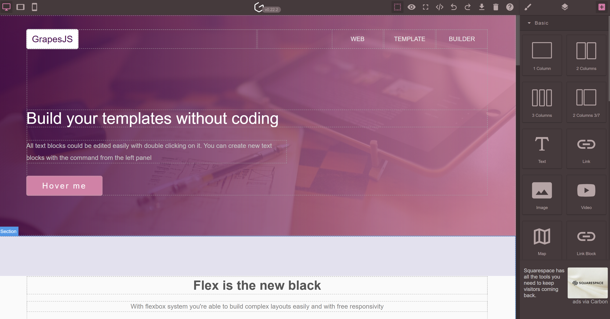

# Sky CMS
[Project Website](https://Sky.moonrise.net) | [Documentation](https://Sky.moonrise.net/Docs) | [Get Free Help](https://Sky.moonrise.net/Support) | [YouTube Channel](https://www.youtube.com/@Sky-cms) | [Install](https://github.com/MoonriseSoftwareCalifornia/SkyCMS?tab=readme-ov-file#installation) | [Slack Channel](https://Sky-cms.slack.com/)

[Sky](https://Sky.moonrise.net/) is an open-source CMS that runs in multiple modes depending on your need:

* Static - All content hosted on a static website with content automatically refreshed. High performance, stability and ease of operation.
* Headless - Content is delivered via API. This is best where content is consumed in many channels, such as web, mobile and desktop.
* Decoupled - Content is delivered via separate, dedicated website. Use this mode to achieve performance that is close to static, yet what "back-end" functionality.

## Our Design Objectives

The objectives behind Sky are as follows:

* Out perform classic CMS's in terms of speed, capacity and stability.
* Easy to use by web developers and non-technical content editors alike.
* Easy to administer, and low cost to operate.
* Offer the ability to easily run in static, decoupled and headless modes.

## Use Cases

* High capacity websites such as those use by governments during emergencies.
* Content-heavy websites like: New York Times, National Geographic, Hulu, Condé Nast, TikTok, Spotify for Artists.
* Efficient content delivery with minimal bytes and handling sudden bursts.
* Multi-regional redundancy with minimal administration.
* User-friendly for non-technical contributors with little training.

## Content Editing Tools

We aimed to create a system that is user-friendly for both web developers and non-technical content editors. Our goal was to enable content editors to create and maintain web pages with minimal training. To achieve this, we assembled the best collection of web content tools available.

### CKEditor 5

[CKEditor](https://ckeditor.com/) is a widely-used "no-code" or [WYSIWYG](https://en.wikipedia.org/wiki/WYSIWYG) (What You See Is What You Get) HTML text editor that allows users to create and edit web content with ease, without needing to write HTML code. It is highly popular due to its robust features, including rich text formatting options, a customizable interface, and extensive documentation [1](https://trends.builtwith.com/widgets/CKEditor). CKEditor supports a wide range of plugins, enabling users to extend its functionality to meet specific needs. Its frequent updates and large community also contribute to its reliability and versatility, making it a preferred choice for developers and content creators alike [2](https://dev.to/keganblumenthal/froala-vs-ckeditor-a-duel-between-the-two-most-popular-html-editors-3igg).

### GrapesJS

[GrapesJS](https://grapesjs.com/) is a free, open-source web builder framework designed to help developers and designers create and customize web pages and HTML templates with ease. It features a visual editor with a drag-and-drop interface, allowing users to build complex web pages without needing extensive coding knowledge [3](https://esketchers.com/grapesjs-things-to-consider-before-using-it/). GrapesJS is popular due to its flexibility, extensive customization options, and a wide range of pre-designed templates and components [4](https://www.talentica.com/blogs/grapesjs-things-to-consider-before-using-it/). It was initially developed to be integrated into Content Management Systems (CMS) to speed up the creation of dynamic templates, making it a versatile tool for both beginners and experienced developers [4](https://www.talentica.com/blogs/grapesjs-things-to-consider-before-using-it/). The ability to export designs in various formats and its active community support further contribute to its widespread adoption [3](https://esketchers.com/grapesjs-things-to-consider-before-using-it/).

See our [YouTube video](https://www.youtube.com/watch?v=mVGPlbnbC5c) that shows GrapesJS at work with Sky.

### Monaco/Visual Studio Code

<image src="./CodeEditor.png" style="max-width: 380px;">

The [Monaco Editor](https://microsoft.github.io/monaco-editor/) is a powerful, open-source code editor that powers Visual Studio Code, Microsoft's popular code editor. It is designed to provide a rich editing experience with features like syntax highlighting, IntelliSense, and code navigation [5](https://snyk.io/advisor/python/monaco-editor). Monaco Editor is highly popular due to its versatility and performance, supporting a wide range of programming languages and being easily embeddable in web applications [6](https://npm-compare.com/codemirror,monaco-editor). Its robust API allows developers to customize and extend its functionality to suit specific needs, making it a preferred choice for many web-based development tools [6](https://npm-compare.com/codemirror,monaco-editor). The active community and continuous updates further enhance its reliability and appeal [5](https://snyk.io/advisor/python/monaco-editor).

Our implementation of Monaco includes a DIFF tool and Emmet Notation.

### Filerobot Image Editor

<image src="./Filerobot.png" style="max-width: 380px;">

[Filerobot](https://scaleflex.github.io/filerobot-image-editor/) Image Editor is a versatile, easy-to-use image editing tool designed to be seamlessly integrated into web applications. It allows users to perform a variety of image transformations such as resizing, cropping, flipping, fine-tuning, annotating, and applying filters with just a few lines of code [7](https://github.com/scaleflex/filerobot-image-editor). Its popularity stems from its simplicity, extensive functionality, and the ability to enhance user experience by providing powerful editing capabilities directly within web platforms [7](https://github.com/scaleflex/filerobot-image-editor). Additionally, its open-source nature and active maintenance ensure it remains up-to-date and reliable for developers [8](https://socket.dev/npm/package/filerobot-image-editor).

### Filepond File Uploader

[FilePond](https://pqina.nl/filepond/) is a versatile file upload library designed for web applications, offering a sleek and customizable interface for handling file uploads. It supports features like image previews, drag-and-drop functionality, and file validation, making it user-friendly and efficient [9](https://npm-compare.com/filepond). FilePond's popularity stems from its ease of integration, extensive customization options, and the ability to handle various file types seamlessly [9](https://npm-compare.com/filepond). Its active community and continuous updates ensure it remains a reliable and up-to-date solution for developers looking to enhance their web applications with robust file upload capabilities [9](https://npm-compare.com/filepond).

## Sky CMS Stack

Sky is a cloud-native application that uses a modern tech stack.

### NoSQL Database - Sky DB

Sky CMS uses **Azure Cosmos DB**, which is a fully managed, globally distributed NoSQL and relational database service provided by Microsoft. It is designed to offer high availability, low latency, and seamless scalability.

### Blob Storage and Static Website

Sky stores static assets uploaded as content to the website in a **blob storage** with a **static website**. This is key to how Sky can perform so well. Hosting website assets this way offers several benefits:

* Blob storage with a static website improves performance by reducing server load and latency.
* Cost-effective and scalable for storing large amounts of unstructured data (images, videos, documents).
* Ensures high availability and durability, protecting against data loss.
* Simplifies deployment and maintenance by eliminating server-side processing.

### Azure App Services

The Editor, Publisher, and API are all ASP.NET Core applications that are Linux Docker containerized.  We deploy each in Web App Services, hosted by App Service plans.  The publisher application also comes in as [NodeJS](https://github.com/MoonriseSoftwareCalifornia/Sky.Publisher.NodeJs) application that is deployed via code, and uses the Sky API service.

## Code Base

Almost 70% of the code base is JavaScript, and much of that is from CKEditor, GrapesJS, Monaco, Filerobot, and Filepond. Back-end logic is written in ASP.NET Core (C#), and that accounts for only 9%. What remains is CSS, HTML, SCSS and TypeScript.

Most of what makes up Sky is NPM and NuGet package-based.

## Docker Containers

The Editor, API and the ASP.NET Core-based Publisher are deployed as Docker containers.  Each can be found on Docker Hub:

* [Editor Docker Container](https://hub.docker.com/r/toiyabe/Sky-editor)
* [API Docker Container](https://hub.docker.com/r/toiyabe/Sky-api)
* [Publisher Docker Container](https://hub.docker.com/r/toiyabe/Sky-publisher)
* [NodeJS Publisher code deploy](https://github.com/MoonriseSoftwareCalifornia/Sky.Publisher.NodeJs)

## Installation

Sky and all its components are installed using a Azure Resource Manager (ARM) template.  The source code for these templates are located in the [ArmTemplates](https://github.com/MoonriseSoftwareCalifornia/SkyCMS/tree/main/ArmTemplates/Installation) folder of this repository.

Go to the [documentation website](https://Sky.moonrise.net/install) to install Sky.
